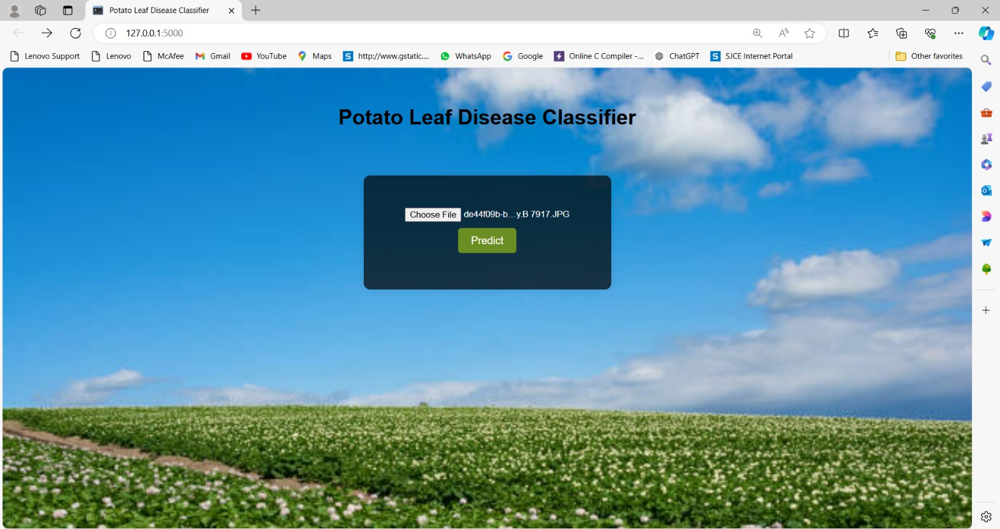
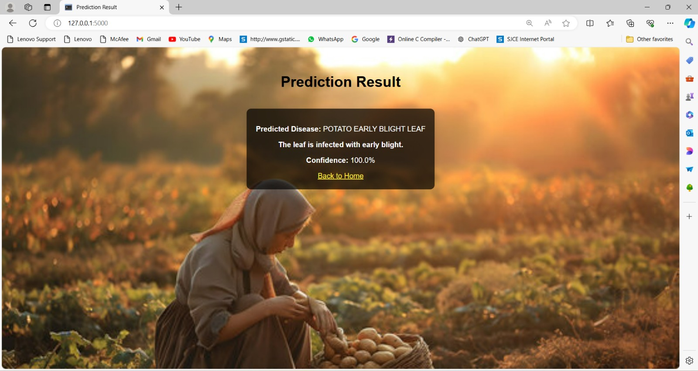

# Potato leaf disease prediction using Deep Learning 

## Introduction

This project aims to assist potato farmers in India by using machine learning to identify diseases, primarily early and late blight, which cause significant economic losses annually. Traditional methods of disease identification are slow and error-prone, making effective treatment difficult.

## Problem Statement

Potato farmers in India face economic losses due to diseases like early and late blight, which damage crops and reduce quality. Traditional identification methods are slow and error-prone, hindering effective treatments.

## Objectives

1. Dataset Collection and Preprocessing
2. CNN Model Design and Implementation
3. Model Training and Epoch Optimization
4. Model Validation and Confidence Scoring
5. Development of User-Friendly Application

## Data Acquisition

The dataset used in this project consists of 2152 images of potato leaves categorized into three classes: early blight, late blight, and healthy leaves. The images were sourced from Kaggle and field collections to ensure diversity for comprehensive analysis.

- **Dataset Source**: [Plant Village Dataset on Kaggle](https://www.kaggle.com/datasets/arjuntejaswi/plant-village)

## System Design

### Methodology

1. **Dataset Collection and Preprocessing**: The dataset consists of 2152 images of potato leaves categorized into three classes: early blight, late blight, and healthy leaves. Images were sourced from Kaggle and field collections to ensure diversity for comprehensive analysis.

2. **CNN Model Design and Implementation**: A Convolutional Neural Network (CNN) was designed and implemented using the TensorFlow framework. The model effectively calculated leaf area and recognized fungal diseases in potato plants.

3. **Model Training and Epoch Optimization**: The model was trained and optimized over different epochs to achieve the best performance. Training, validation, and loss were evaluated over 20, 30, and 50 epochs, with the model performing best at 50 epochs with an accuracy of 97.67%.

4. **Model Validation and Confidence Scoring**: The model's performance was evaluated based on training and validation accuracy and loss over different epochs. The results show that the model performs best at 50 epochs.

5. **Development of User-Friendly Application**: A Flask-based web application was developed to allow users to upload images of potato leaves and receive real-time disease predictions.

## Tools and Technologies

- **Programming Language**: Python
- **Libraries and Frameworks**:
  - TensorFlow and Keras for model implementation
  - Flask for web application development
  - NumPy and Werkzeug for various functionalities
  - Matplotlib for data visualization
  - Python Imaging Library for image processing

## System Implementation

### Data Preprocessing

Data was preprocessed by removing irrelevant portions through image segmentation or object detection and scaling images to 256x256 pixels using TensorFlow's Image Data Generator for consistency and improved model performance.

### Data Augmentation

Geometric transformations like translations, rotations, scale changes, shearing, and flips were applied to enhance dataset diversity.

### Image Classification

Machine learning, specifically deep learning, was utilized, focusing on CNNs for plant disease identification through leaf health analysis. The CNN architecture included layers for input, convolution, pooling, fully connected, dropout, and output for disease classification.

## Results of Implementation

- **20 Epochs**: Training and validation accuracy showed the model performed best with an accuracy of 94.17%.
- **30 Epochs**: Improved performance with an accuracy of 96.19%.
- **50 Epochs**: Best performance with an accuracy of 97.67%.

### Training and Validation Accuracy and Loss

Training, validation, and loss metrics were evaluated for 20, 30, and 50 epochs, showing the model's performance improvement over these epochs.

## UI Implementation

The web application allows users to upload an image of a potato leaf and receive a disease classification. The interface includes:

- **File Upload Form**: "Choose File" button to upload an image.
- **Predict Button**: Submits the image for classification.
- **Prediction Result Display**: Shows the disease prediction and confidence score.
- **Back to Home Link**: Navigate back to upload another image.

Steps to follow:

1. Home Page: File upload form
2. File Upload: Preprocess image
3. Predict Disease: Use pre-trained model for classification
4. Display Result: Show predicted disease and confidence score
5. Back to Home: Upload another image

## Screenshots

Here are the screenshots for the home page, including uploading, predicting, and navigating back to the home page for different test cases:

### Predicting Disease

The application processes the uploaded image and predicts the disease status of the potato leaf.

### Back to Home

User navigates back to the home page after viewing the prediction results, ready to upload another image or perform a new prediction.

## Conclusion

The project successfully utilizes Convolutional Neural Networks to accurately classify potato leaf diseases. The implementation of a Flask-based web application allows for easy image uploads and provides real-time disease predictions to farmers. This enables informed crop management decisions, enhances agricultural efficiency, and promotes sustainability. The model achieved high accuracy, particularly at 50 epochs with an accuracy of 97.67%, making it a reliable tool for disease identification in resource-limited environments.
